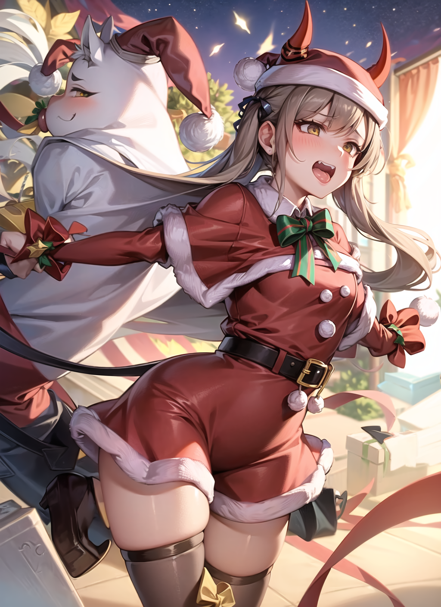

# Progen :twisted_rightwards_arrows:
A prompt generator for stable diffusion (AI generated image), based on random choices. Fully focused on the randomness of the prompts, generating good, unexpected and strange images

## Requirements :toolbox:
You will only need

```
python 3.8 or newer
pyperclip 1.8.2 or newer
```
if you already have python updated just do this
```
!pip install pyperclip
```

## About :bookmark_tabs:

This script can be considered just a random word generator, but with tags that can have some effect on the Image Generators, a big part is done depending on how the AI interprets each word.

For example if I have a prompt like this `1girl,limp_arms,super_shadow,santa_outfit,devil_(housamo),knot_in_mouth,perfect art,`<br>



The words don't really have to make sense, I've noticed that most of the time the AIs interpret many tags in interesting ways

So based on that I created a script which has a prompt generation with some modifications, which can help to generate the prompts, Progen doesn't necessarily need to be used to use the prompt generation from scratch, but also to complement the already existing prompts

|Original       | Progen       |
| ----------- | ----------- |
`1girl,short hair,white hair,angel wings,yellow eyes`| `1girl,short hair,white hair,angel wings,yellow eyes,cunning,strong,likely,well-favored,Majestic Mountain,otherworldly,industrial gothic,pastel,divine`
|`1boy, black hair, red eyes, scar, holding dagger,`|`1boy, black hair, red eyes, scar, holding dagger,,consistent,assertive,sincere,affectionate,Space Odyssey,Resplendent,Fierce,extravagant,regal,floral,darkness vibe`|
|`landscape`|`landscape,enchanted bookshop with rare and magical books,The Plane of Positive Energy,Elemental Plane of Fire,chill,Radiant,glam rock,pastel,j-pop,cosmic`|

## Some Features :star2:

* Custom Startup Prompts :pencil: <br>
  You are not limited to using `1girl` or `1boy`, you can choose how the prompt will start and end.
 
  
|Initial     |End     | Progen      | 
| ----------- | ----------- | ----------- |
| `Golden Apple`|`Magic Style`|`Golden Apple,presentable,accomplished,showy,watchful,underground nightclub with live performances and a VIP area,Naga's Temple,strange,jazzy,Legendary,Magic style`|
| `Metal Dinosaur` |`Wild Style`| `Metal dinosaur,straightjacket,fun,affectionate,gorgeous,delightful,moral,entire,Hilarious Laugh,Wrathful,Fantasy River,The Garden of the Fates,sci-fi,new age,astrological,atmospheric,Wild Style`<br>

- AutoCopy :page_with_curl: <br>
  Something that may seem a bit silly but with each generation of a prompt your prompt is automatically copied, thus making the prompt to be used much more     easily thanks to `pyperclip` *(copying directly from the terminal is terrible)* <br>

- Three Generation Modes :file_folder: <br>
  Existe 3 modos (dois se voce considerar Nsfw ON/OFF o mesmo)
    * Nsfw On :no_entry_sign: <br>
        Basically this mode doesn't have any kind of filter so it can generate NSFW images very easily, in it you can choose the number of tags ranging from         0 to infinity
<br> <br> Num 9, End "God Light" ↓ 
`1girl,deku_princess,sdjenej_(artist),gabrieltenma77,feral_to_human,mina_heartfields,peeing_into_container,donacutie,dominant_human,ash_bunny_(skeleion),yeila,God Light,` <br> <br> Num 10, End "God Light" ↓ <br> 
 `1girl,hiro_(spectral_force),gamutfeathers,sakura_(doors),tomimi_(arknights),beach,anne_(arcnod),睁开眼睛,terri_(morkai88),black_line_art,sinmo_(dolomang),God Light,` <br> <br>  Num 9, End "cool stuff" ↓ <br>
`1girl,bastianmage,cervical_prolapse,energy_blade,laramee_(aj_the_flygon),colored_condom,miles_(anti-tails),tori_cro_(bistup),morisawa_haruyuki,kuze_(ira),swimsuit_around_one_leg,cool stuff,`

    you also have the possibility to continue based on the number of tags like this
    
    Num 2 <br>
    `1girl,autocloacalingus,hio_(hiohio0306),` <br>
    -----↓----- <br>
    Continue <br>
    -----↓-----<br>
    Num 4 *(2 + 2)*
    <br>
    `1girl,autocloacalingus,hio_(hiohio0306),manny_ambassada,yellow_tunic,`
    
    
    * Nsfw OFF :no_entry: <br> 
    :warning: *(It's not 100% filtered, it's just less likely)* :warning: <br> 
     The only difference between Nsfw OFF and Nsfw ON is that it is less likely to see NSFW tags, but I recommend using **(Nsfw:1.5)** for negative prompts,      Nsfw OFF contains the number of tags, choice of end and option of continue and no difference about it <br><br> 
    
    * Templete Mode :bookmark_tabs: <br> 
      the template mode is basically a way that you can choose tags from specific themes, that is, you can choose the number of tags for each specific theme, but not all have just one specific theme, after all, if it were fully controllable, it would lose a little about the purpose, the idea is to be random, the tags you can choose are
      - Hair
      - Eyes
      - Clothes
      - Good_Adj *(Good Adjectives)*
      - Any_Adj  *(Any Adjectives)*
      - Bad_Adj  *(Bad Adjectives)*
      - Emotion
      - Background
      - Fantasy_Config
      - Vibe
      - End_Prompt <br> 
      
      for example if you have a beginning "1girl" and ending "Darkness Palette" and with `Hair 1` `Eyes 1` `Fantasy_Config 1` `Vibe 3`<br> 
      |Initial     |Hair | Eye | Fantasy_Config |Vibe |End |
      | ----------- | ----------- | ----------- | ----------- | ----------- | ----------- |
      |`1girl`|`Violet straight_hair`  |`magenta nodoka_glasses`|`The Feywild`|`museum,Flawless,Sublime`|`Darkness Palette` <br> 
      |`1girl`|`Honolulu downcast_eyes`|`Nyanza brown_beak`     |`Necromancer's Lair`|`Fanciful,pastel,starry`|`Darkness Palette` <br> 
      |`1girl`|`Chili landolt_tamaki`  |`Wild over-rim_glasses` |`Angel's Citadel`   |`Sublime,sci-fi,brilliant`|`Darkness Palette` <br> 
      
      
      You may have realized that some of these tags don't make sense, but as I said earlier it's not 100% a specific theme, and also the part of         interpretation by the AI comes in, so it can generate a lot of different things <br>
      
      # How to use :open_book:
      to use Progen just run `Start.py`
      ```
      python Start.py
      ```
      And choosing the available options directly from the terminal, there's no secret, it's very simple
       ```
      'g' to generate (this goes into the generation options)
      'q' to quit
      ```
      
      
      # Examples :notebook:
      Next I will show some examples of generations made with Progen
     <br>
     
     * 
     * `1girl,Yellow rudolph_the_red-nosed_reindeer,Cadmium eyes_in_shadow,Spanish polka_dot_hoodie,Shocking green_lipstick,hot,Patriotic Salute,Joyful,Virtual Island,Ethereal,Twinkling,Hypnotic,Miraculous` <br> <br>
**Negative prompt** `(NG_DeepNegative_V1_75T:1.4),(worst quality:1.4), (low quality:1.4) , (monochrome:1.1),(bad_prompt_version2:0.8),<br> <br> (EasyNegative:0.8),twitter username, patreon username,weibo username, deviantart username` <br> <br>
**Steps: 20, Sampler: DPM++ 2M Karras, CFG scale: 7, Seed: 2100077192, Size: 720x512, Model hash: 2202fecad7, Model: TriPhaze_C, Clip skip: 2** <br> <br>
     ---
     
     * 
     * `best quality,1girl,yellow doctor,sea brown_neckerchief,OU green_skirt,Electric crystal earrings,magnificent,exquisite,Exultant,Dramatic Swoon,Enchanted Cottage,Brilliant,Enchanted,regal,Elegant`<br> <br>
     **Negative prompt** `(NG_DeepNegative_V1_75T:1.4),(worst quality:1.4), (low quality:1.4) , (monochrome:1.1),(bad_prompt_version2:0.8),(EasyNegative:0.8),twitter username, patreon username,weibo username, deviantart username` <br> <br>
     **Steps: 20, Sampler: DPM++ 2M Karras, CFG scale: 7, Seed: 1564046105, Size: 720x512, Model hash: 2202fecad7, Model: TriPhaze_C, Clip skip: 2** <br> <br>
     ---
     * 
     * `best quality,1girl,Opal lolidom,sky purple_mascara,Cardinal yellow_seam_briefs,yonder unfezant,splendid,sublime,Hostile,Retiring,Neon Metropolis,Mystical,Impeccable,Bright,Transcendent`<br> <br>
     **Negative prompt** `(NG_DeepNegative_V1_75T:1.4),(worst quality:1.4), (low quality:1.4) , (monochrome:1.1),(bad_prompt_version2:0.8),(EasyNegative:0.8),twitter username, patreon username,weibo username, deviantart username`<br> <br>
     **Steps: 20, Sampler: DPM++ 2M Karras, CFG scale: 7, Seed: 2290708141, Size: 720x512, Model hash: 2202fecad7, Model: TriPhaze_C, Clip skip: 2**
     ---
     * 
     * `best quality,1girl,(web) impossible_hair,pink boarded_windows,Strawberry v-shaped eyebrows,Cadmium green_eyeshadow,Bistre bikini_bottom,green tan_jacket,(Crayola) pon_de_ring,pink grey_lipstick,good,desirable,pretty,Hilarious Laugh,Radiant Smile,Sci-Fi Canyon,Fantastic,Radiant,Resplendent,Crystal` <br> <br>
     **Negative prompt** `(NG_DeepNegative_V1_75T:1.4),(worst quality:1.4), (low quality:1.4) , (monochrome:1.1),(bad_prompt_version2:0.8),(EasyNegative:0.8),(worst face:1.1)`<br> <br>
     **Steps: 20, Sampler: DPM++ 2M Karras, CFG scale: 7, Seed: 1236495140, Size: 720x512, Model hash: 2202fecad7, Model: TriPhaze_C, Clip skip: 2**<br> <br>
     
     # Obs :page_facing_up:
     This is my first project on Github, so I don't understand much of what I'm doing, so it could probably be a lot of trouble, but I'd love to be informed :D
     # License :scroll:
     [MIT](https://choosealicense.com/licenses/mit)
     
     
     
     
     
